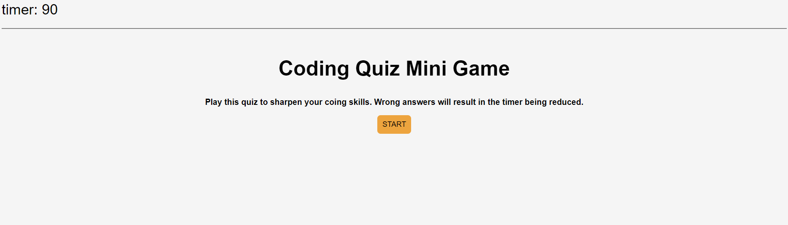
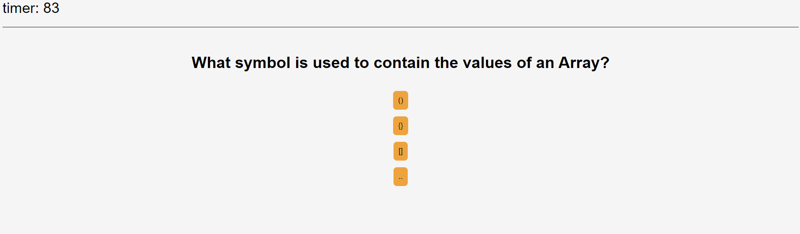
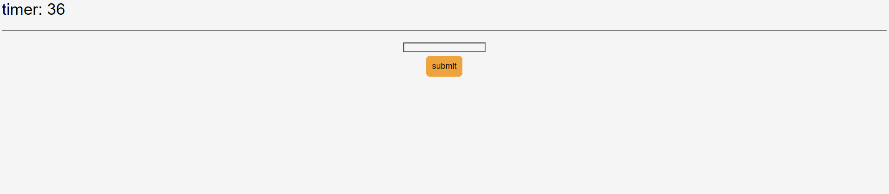
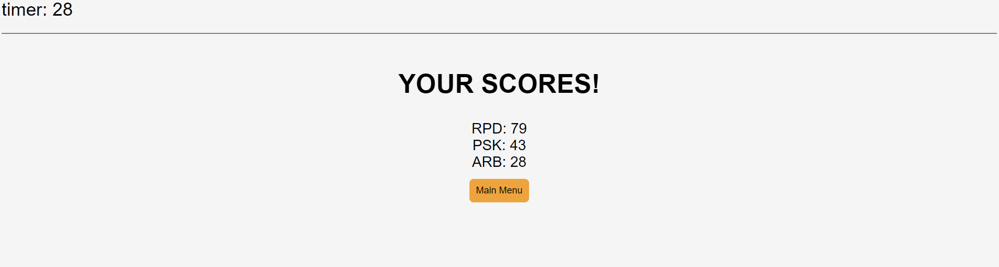

# Coding Quiz

# About
In this app you are presented with a quiz about common web development ideas.

Once you press the start button you are given 90 seconds to answer 9 questions.  If you answer incorrectly you will be docked 10 seconds on the timer.  Once the timer runs out or you answer all of the questions you will be given the chance to record your name and your score (which is your remaining time).  Your five best times will be kept on the leaderboard.

# Languages Used
HTML
CSS
Javascript

# Screenshots

